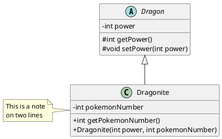

#UML

L'uml est un langage de modélisation qui permet de représenter des objets et leurs interactions.

## Diagramme de cas d'utilisation

Un diagramme de cas d'utilisation est un diagramme qui permet de représenter les interactions entre un acteur et un système.

## Dragramme de classe

Un diagramme de classe est un diagramme qui permet de représenter les classes d'un système.

Exemple de diagramme de classe:

